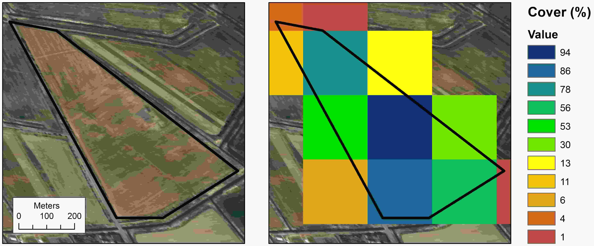
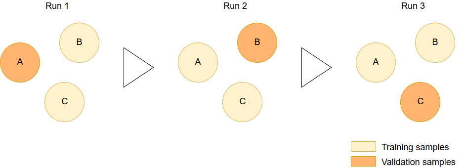

```{r setup, include = FALSE}
knitr::opts_chunk$set(
  collapse = TRUE,
  comment = "#>"
)
```


```{r echo=FALSE, message=FALSE, warning=FALSE}
# load packages
library(fieldRS)
library(raster)
library(ggplot2)
library(knitr)
library(kableExtra)
library(CAWaR)
```


### CAWaR - Supporting Sustainable Water Usage Through Open-source Software
<p align="justify" style="line-height:200%;">
`CAWaR`^[`CAWaR` was developed at the University of Würzburg, Germany, as part of the project Research Network Water in Central Asia (<a href="http://www.cawa-project.net/">CAWa</a>) funded by the German Federal Foreign Office. It is part of the German Water Initiative for Central Asia (the so-called “Berlin process”), which the German Federal Foreign Office launched on 1 April 2008 in order to support peaceful, sustainable and mutually beneficial management of transboundary water resources in Central Asia.] was build to automatize and consolidate technical tasks related to crop type classification and mapping. This package is addressed to scientists and public authorities in Central Asia, especially the ones dealing with water use efficiency. In the context of climate change, water usage for the purpose of food production becomes threatened and its a particular issue in areas such as Central Asia. Here, agricultural production is highly dependent on irrigation and can thus be compromised in periods of water scarcity potentialy leading to food insecurity. As a result, understading the spatial and temporal distribution of crops is essential offering and understanding of local water requirements and helping build more efficient water management and distribution plans.
</p>

</br>

### Example data
<p align="justify" style="line-height:200%;">
`CAWaR` is closely related to `fieldRS`. As a result, it makes use of some of its example data, namely:
</p>
* `ndvi` - *RasterStack* with 5 time steps of Normalized Difference Vegetation Index (NDVI) images.

* `fieldData` - *SpatialPolygonsDataFrame* containing ground truth data on crop types.

* `referenceProfiles` - *data.frame* with NDVI profiles for target crop types.

<p align="justify" style="line-height:200%;">
Most data can be accessed with the `data()` function with the exception of the raster data. This is due to the fact that raster data is stored in the temporary memory when loaded and it can't be saved as an R object. Below we can see how to load each dataset into R.
</p>

``` {r message=FALSE}
ndvi.ts <- brick(system.file("extdata", "ndvi.tif", package="fieldRS")) # NDVI raster time series
data(fieldData) # ground truth data
data(referenceProfiles) # target crop types NDVI profiles
```
```{r echo=FALSE}
ndvi.ts <- extend(ndvi.ts, 30)
```

</br>

### Can I use my ground-truth data?
<p align="justify" style="line-height:200%;">
To perform a cropland classification we require samples on different crop types that help us describe their temporal and spatial variability. To do so, we often travel to the field to collect ground-truth data using Geographic Positioning Systems (GPS) and visual interpretation. This data is valuable and provides us with precise information that can be used to train a classifier and validate its results. However, this data often comes with certain inconsitencies. When digiting the collected information on errors such as the mispelling of classes and the overlapping of samples can occur influence future processing steps and result in time-consuming re-runs. To aid in the identification of errors, we can use a series of tools:
</p>

* `checkSamples()` - Checks for the information provided by a shapefile containing ground-truth data and checks for relevant fields and their formats.

* `checkLabels()` - Checks for mispellings in sample labels and helps correct them in an efficient and timely manner.

* `geCheck()` - Checks for spatial overlaps between polygons.

<p align="justify" style="line-height:200%;">

</p>

<p align="justify" style="line-height:200%;">
Let's first start with `checkSamples()`. This function checks if a shapefile of ground-truth data contains relevant information fields. The function searches for the following variables:
</p>

* `sampler` - Name of the responsible for the sample collection.
* `date` - Date vector with sample acquisition date in `yyyy-mm-dd` format.
* `label` - Character vector with class of filed sample.

<p align="justify" style="line-height:200%;">
While knowing the label is a clear requirement, knowing the data and the same of the sampler can also be useful. First, knowing the data can clear doubts when checking samples visualy. In areas intra-annual crop rotation occurs, samples with data information can help us better decypher complex temporal profiles created by multiple growth cyles related to different crops. Second, knowing the name of the sampler can help us clear additional doubts. Often, the person responsible for analyting the ground-truth data is not the same responsible for collecting it. As a consequence, this person may lack knowledge on the sampling sites that can be provided by the sampler. As shown below, calling `checkSamples()` will return a `data.frame` reporting on the existence of the nominated fields and the consitency of their format.
</p>

``` {r}
sampleTest <- checkSamples(fieldData)
```

``` {r, out.width="98%", fig.height=5, fig.width=10, dpi=600, fig.align="center", fig.show='hold', echo=FALSE}
kable_styling(kable(head(sampleTest, 1), format="html", align="c", full_width=TRUE), "stripped", bootstrap_options="responsive")
```

<p align="justify" style="line-height:200%;">
Once we clear this step, we can check for additional, common issues. First, lets check for geometric errors. When drawing polygons on the field we might sometimes overlap them mistakingly which can lead to misleading results. But there are other situations in which this might happen. For example, if multiple field campaings are conducted in the same area, we sometimes will find that a crop field was sampled twice leading to duplicated samples.
</p>
<p align="justify" style="line-height:200%;">
In order to address these issues, we can use `geCheck()`. The function will test all the polygons in a shapefile agains each other, report on any existing overlaps and display the areas where overlaps were found. Lets test the function.
</p>

``` {r}
sampleTest <- geCheck(fieldData)
```

``` {r, out.width="98%", fig.height=5, fig.width=10, dpi=600, fig.align="center", fig.show='hold', echo=FALSE}
kable_styling(kable(head(sampleTest, 1), format="html", align="c", full_width=TRUE), "stripped", bootstrap_options="responsive")
```

<p align="justify" style="line-height:200%;">
The output shows us an empty `data.frame`. This is because `fieldData` has no geometric errors. But what if two polygons overlap? To test this we will create a shapefile with two overlapping polygons and test `geCheck()` again.
</p>

``` {r}
# build polygons
p1 <- Polygons(list(Polygon(data.frame(x=c(1, 5, 10, 2, 1), y=c(10, 9, 8, 7, 10)))), ID=1)
p2 <- Polygons(list(Polygon(data.frame(x=c(2, 6, 5, 4, 2), y=c(10, 9, 7, 4, 10)))), ID=2)
p <- SpatialPolygons(list(p1, p2))

# check overlap
sampleTest <- geCheck(p)
```

``` {r, out.width="98%", fig.height=5, fig.width=10, dpi=600, fig.align="center", fig.show='hold', echo=FALSE}
kable_styling(kable(head(sampleTest$overlap.df, 1), format="html", align="c", full_width=TRUE), "stripped", bootstrap_options="responsive")

plot(p)
plot(sampleTest$overlap.shp, col="red", add=TRUE)
```

<p align="justify" style="line-height:200%;">
The function returns a `data.frame` and a `SpatialPolygons` object. The first shows the polygon indices that overlap with each other. The second shows the overlapping area between them - shown in red in the example figure.
</p>
<p align="justify" style="line-height:200%;">
Now that we check for content and geometry errors we can proceed to check the labels of the samples. As mentioned before, mispellings can occur when digitizing field data. Thus, samples need to be double-checked. But such task can be tiring and can perputuate mistakes due to human error. To minimize this issue we can use `labelCheck()`. Initially, the function will provide the unique labels in a shapefile. In the case of `fieldData`, this information is contained in the field `crop`. Running the function, we will obtain a `data.frame` with an analysis of the distribution of samples per unique label and a plot of the same data made with `ggplot`. This means that the plot can be edited by users and tailored to e.g. their own scientific reports. The unique labels are provided as a single vector. Looking at the output we can check if there are any mispellings or wrong naming conventions.
</p>

```{r}
sampleCorrect <- labelCheck(fieldData$crop)
sampleCorrect$labels # unique labels
```

``` {r, out.width="98%", fig.height=5, fig.width=10, dpi=600, fig.align="center", fig.show='hold', echo=FALSE}
kable_styling(kable(head(sampleCorrect$label.count, 3), format="html", align="c", full_width=TRUE), "stripped", bootstrap_options="responsive")
sampleCorrect$label.count.plot
```
<p align="justify" style="line-height:200%;">
In this case we don't seem to have any of these issues. However, for the purpose of this analysis, let's assume we wish to classify "wheat" and "not-wheat". This means that the classes "cotton" and "bare land" will have to be renamed. To achieve this, we can now provide `labelCheck()` with a corrected set of labels that matches the set of original labels. We will assign it to a new field in `fieldData` called `crop_2`. In this case, the component `labels` will report a full set of corrected labels instead of the unique occurrences. Additionally, as we saw before, we will obtain a plot with the count of samples per class.
</p>

```{r}
sampleCorrect <- labelCheck(fieldData$crop, sampleCorrect$labels, c("wheat", "not-wheat", "not-wheat"))
fieldData@data$crop_2 <- sampleCorrect$labels
```

``` {r, out.width="98%", fig.height=5, fig.width=10, dpi=600, fig.align="center", fig.show='hold', echo=FALSE}
kable_styling(kable(head(sampleCorrect$label.count, 3), format="html", align="c", full_width=TRUE), "stripped", bootstrap_options="responsive")
sampleCorrect$label.count.plot
```

</br>

### Extracting temporal profiles
<p align="justify" style="line-height:200%;">
The crop classification algorithm built in the scope of the CAWa project distinguishes crop types based on their unique phenological behaviour. To know how distinctive the growth cycle of a particular crop ground-truth data is quite informative. Since single pixels can be misleading due to e.g. uneven growth patterns within a field, it might be useful to summarize the overlapping pixels into a single time-series. However, when dealing with field polygons, not all the collected pixels are useful. Along the borders of a sampled field we might note - as depicted in the image below - that some pixels are only partialy covered and might be shared with fields that contain different crops with distinct growth cycles. As a consequence, a simple averaging of the pixels might bot be sufficient to efficiently summarize the temporal variable of the target crop within the drawn polygon.
</p>

</br>

``` {r, out.width="98%", fig.height=5, fig.width=10, dpi=600, fig.align="center", fig.show='hold', echo=FALSE}

```
<p lign="center">Example figure showing the change in the percent overlap between a polygon and a reference raster grid.</p>

</br>

<p align="justify" style="line-height:200%;">
To address this issue, we can use `extractTS()`. This function will iterate through each polygon in a shapefile, extract the corresponding pixels and derive the mean of their values weighted the percent overlap for each pixel. In other words, border pixels will contribute less for the final time series than the center ones. Let's apply this function to `fieldData`. As environmental predictors, we will use the `ndvi.ts` `RasterBrick` provided through `fieldRS`. The function returns a weighted-mean time-series as well as the original pixel - with coordinates and percent cover values - and a summary of the each polygon reporting on the min, max and mean cover and the count of pixels. 
</p>

```{r eval=FALSE, message=FALSE}
fieldDataTS <- extractTS(fieldData, ndvi.ts)
```

``` {r, out.width="98%", fig.height=5, fig.width=10, dpi=600, fig.align="center", fig.show='hold', echo=FALSE}
data(fieldDataTS)
kable_styling(kable(head(fieldDataTS$pixel.info, 5), format="html", align="c", full_width=TRUE), "stripped", bootstrap_options="responsive")
kable_styling(kable(head(fieldDataTS$polygon.info, 5), format="html", align="c", full_width=TRUE), "stripped", bootstrap_options="responsive")
kable_styling(kable(head(fieldDataTS$weighted.mean, 5), format="html", align="c", full_width=TRUE), "stripped", bootstrap_options="responsive")
```

</br>
### Building reference profiles: How should my crops look like?
<p align="justify" style="line-height:200%;">
When on the field, sometimes mislabelings can occur. Thus it is important that we check eah polygon visually. `analyzeTS()`can help us in this task. The function will derive statistics for each unique class in `fieldData` and use the median of each time-step to build a plot. While some samples might be wrongly labeled, we assume most of them are correct and that the median offers an accurate depiction of the ideal profiles.
</p>

```{r}
checkTS <- analyzeTS(as.data.frame(fieldDataTS$weighted.mean), fieldData$crop_2)
```
``` {r, out.width="98%", fig.height=5, fig.width=10, dpi=600, fig.align="center", fig.show='hold', echo=FALSE}
checkTS$plots
```

<p align="justify" style="line-height:200%;">
Additionally, the function will correlate the profile of every sample with the median profiles of each unique class. This will ease the time requirement of looking at every sample. Assuming that correct samples will be highly correlated with the median profiles, poor correlations will like point to samples for which labels need correction. If this happens, we can again use `checkLabels()` for the correction.
</p>

``` {r, out.width="98%", fig.height=5, fig.width=10, dpi=600, fig.align="center", fig.show='hold', echo=FALSE}
kable_styling(kable(head(checkTS$r2, 5), digits=c(2,2), format="html", align="c", full_width=TRUE), "stripped", bootstrap_options="responsive")
```

<p align="justify" style="line-height:200%;">
If the user wishes to check the profiles for every sample, `extractTS()` can still be useful. Instead of providing classes, the user can provide unique ID's for each polyogn. This way, the function will build a plot for each sample which can be saved separately using `ggsave`.
</p>

```{r, eval=FALSE}
checkTS <- analyzeTS(as.data.frame(fieldDataTS$weighted.mean), 1:length(fieldData))

for (p in 1:length(fieldData)) {ggsave(checkTS$plots[[p]], paste0("./", checkTS$labels[p], ".png"), width=10, height=10, units="cm")}
```

</br>

### PhenoCropVal: A new concept of land cover validation!
<p align="justify" style="line-height:200%;">
Up to this point we completed the pre-processing of `fieldData` and derived reference profiles for the classes that should be distinguished. However, before we build a map from this, we might want to check how good the classification is expected to be. This avoids time-consuming raster processing and helps antecipate the need for further pre-processing. `phenoCropVal()` does just that. In practice, this algorithm will use `analyzeTS()` to build reference profiles. The main difference is in how it separates training and validation data. The function requires a vector showing which samples should be grouped. Then, it keeps each group for validation while the remaining samples are used to build reference profiles for each class using `analyzeTS()`. The function will then call `phenoCropClass()` to classify the validation profiles and will identify the samples that passed and failed the test. This process is repeated for each group in each class. For each class, the function will derive an F1-score as an accuracy measure which is estimated from the total amount of true and false positives collected at each iteration.
</p>

``` {r, out.width="98%", fig.height=5, fig.width=10, dpi=600, fig.align="center", fig.show='hold', echo=FALSE}

```
<p lign="center">Depiction of the validation process for one class. One group is kept for validation while the remaining ones are used for training.</p>

<p align="justify" style="line-height:200%;">
To assure that neighooring - and therefore spatialy auto-correlated - samples are not kept toguether during validation, we will first use `splitSamples()`. This function performs a spatial clustering approach labeling samples within a predefined spatial distances as part of the same group. The function provides a vector with the region label for each sample and an account of the pixel frequency per sample.
</p>

```{r eval=FALSE}
fieldDataCluster <- splitSamples(fieldData, ndvi.ts, fieldData$crop_2, agg.radius=60)
```
```{r echo=FALSE}
data(fieldDataCluster)
```
``` {r, out.width="98%", fig.height=5, fig.width=10, dpi=600, fig.align="center", fig.show='hold', echo=FALSE}
kable_styling(kable(head(fieldDataCluster$region.frequency, 5), format="html", align="c", full_width=TRUE), "stripped", bootstrap_options="responsive")
```

<p align="justify" style="line-height:200%;">
Now we can use `phenoCropVal()` to check the accuracy of our predicitons. The function will return a `data.frame` with class-wise F1-scores as well and a plot based on it. 
</p>

```{r}
cropVal <- phenoCropVal(as.data.frame(fieldDataTS$weighted.mean), fieldData$crop_2, fieldDataCluster$region.id)
```
``` {r, out.width="98%", fig.height=5, fig.width=10, dpi=600, fig.align="center", fig.show='hold', echo=FALSE}
kable_styling(kable(head(cropVal$class.accuracy, 5), digits=c(2,2), format="html", align="c", full_width=TRUE), "stripped", bootstrap_options="responsive")
cropVal$accuracy.plot
```

<p align="justify" style="line-height:200%;">
Additionally, the function will identify which samples were corrently and incorrectly classified through a logical vector named `sample.validation`. in combination with `fieldData`, this result helps us perceive the spatial distribution of errors and, in some cases, might even help us identify poor quality samples that missed the initial checks.
</p>

```{r eval=FALSE}
fieldData$validation <- as.factor(cropVal$sample.validation)
spplot(fieldData["validation"])
```

``` {r, out.width="98%", fig.height=5, fig.width=10, dpi=600, fig.align="center", fig.show='hold', echo=FALSE}
fieldData$validation <- as.factor(cropVal$sample.validation)
spplot(fieldData["validation"])
```

</br>


